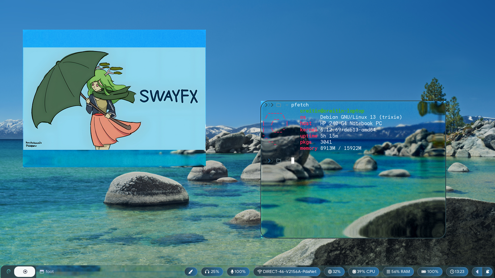

<p align="center">
    
</p>

Sway is an incredible window manager, and certainly one of the most well established Wayland window managers. However, it is restricted to only include the functionality that existed in i3. This fork ditches the simple `wlr_renderer`, and replaces it with our `fx_renderer` (via [scenefx](https://github.com/wlrfx/scenefx)), capable of rendering with fancy GLES2 effects.

### Note: this is a fork of the original [swayfx](https://github.com/WillPower3309/swayfx) repository.

SwayFX expands Sway's feature set to include eye-candy that many users have been asking for:

+ **Blur**: Sophisticated background blur for windows and layers.
+ **Shadows**: Real-time window drop shadows.
+ **Rounded Corners**: Anti-aliased rounded corners for windows, borders, and titlebars.
+ **Animations**: Smooth window movement and resizing animations.
+ **New: Liquid Glass (Experimental)**: A unique refractive glass effect.
+ **Dimming**: Dim unfocused windows to help you focus.
+ **Layer Shell Effects**: Apply blur, shadows, and rounded corners to panels and notifications.
+ **Scratchpad treated as minimize**: Allows docks and taskbars to correctly interpret minimize/unminimize requests.
+ **Nixified**: First-class support for Nix and NixOS.

<p align="center">
    
</p>

### Animations
Control the duration of window movement and resizing animations.
- `animation_duration_ms <value>`: Duration in milliseconds (0-5000, default: 0).

### Blur
Global blur settings and per-window toggles.
- `blur <enable|disable>`: Global toggle.
- `blur_xray <enable|disable>`: Blur floating windows based on the desktop background instead of windows below.
- `blur_passes <integer>`: Number of blur passes (0-10).
- `blur_radius <integer>`: Blur radius (0-10).
- `blur_noise <float>`: Amount of noise to add to the blur (0-1).
- `blur_brightness <float>`: Adjust blur brightness (0-2).
- `blur_contrast <float>`: Adjust blur contrast (0-2).
- `blur_saturation <float>`: Adjust blur saturation (0-2).
- `for_window [CRITERIA] blur <enable|disable>`: Per-window toggle.

### Corner Radius
- `corner_radius <pixels>`: Set the radius for rounded corners.
- `smart_corner_radius <enable|disable>`: Automatically disable rounded corners when a window is fullscreen or the only one on a workspace (if gaps are 0).

### Shadows
- `shadows <enable|disable>`: Global toggle.
- `shadows_on_csd <enable|disable>`: Enable shadows on windows with Client-Side Decorations.
- `shadow_blur_radius <pixels>`: Blur radius for shadows (0-99).
- `shadow_color <hex>`: Shadow color (e.g., `#0000007F`).
- `shadow_inactive_color <hex>`: Shadow color for unfocused windows.
- `shadow_offset <x> <y>`: Offset for the shadow.

### Dimming
- `default_dim_inactive <0.0 - 1.0>`: Set the default dimming for inactive windows.
- `for_window [CRITERIA] dim_inactive <0.0 - 1.0>`: Per-window dimming.
- `dim_inactive_colors.unfocused <hex>`: Color used for dimming unfocused windows.
- `dim_inactive_colors.urgent <hex>`: Color used for dimming urgent windows.

### Layer Shell Effects
Apply effects to specific layer shell namespaces (e.g., "waybar", "notifications").
- `layer_effects <namespace> <effects>`
- Available Effects:
    - `blur <enable|disable>`
    - `blur_xray <enable|disable>`
    - `blur_ignore_transparent <enable|disable>`
    - `shadows <enable|disable>`
    - `corner_radius <pixels>`
- Example:
    ```sway
    layer_effects "waybar" {
        blur enable
        blur_ignore_transparent enable
        shadows enable
        corner_radius 10
    }
    ```

### Liquid Glass (Experimental)
A refractive glass effect that distorts the background.
- `liquid_glass <enable|disable>`
- `liquid_glass_bezel_width <float>`
- `liquid_glass_brightness_boost <float>`
- `liquid_glass_chromatic_aberration <float>`
- `liquid_glass_noise_intensity <float>`
- `liquid_glass_refraction_index <float>`
- `liquid_glass_saturation_boost <float>`
- `liquid_glass_specular <on/off>`
- `liquid_glass_specular_opacity <float>`
- `liquid_glass_specular_angle <float>`
- `liquid_glass_surface <convex_circle|convex_squircle|concave|lip>`
- `liquid_glass_thickness <float>`

### Miscellaneous
- `titlebar_separator <enable|disable>`: Show or hide the separator between the titlebar and window content.
- `scratchpad_minimize <enable|disable>`: Treat hiding a window to the scratchpad as minimizing it.

## Roadmap

+ Improve Liquid Glass stability and performance.

## Compiling From Source

### Nix

If you have Nix installed, you can build and run SwayFX easily:

```bash
nix build
./result/bin/sway
```

For development:
```bash
nix develop
```

### Debian

Check [INSTALL-deb.md](/INSTALL-deb.md)

### Container (Docker)

```bash
docker compose up --build
```

### Manual Steps

Install dependencies:
`meson`, `wlroots`, `wayland`, `wayland-protocols`, `pcre2`, `json-c`, `pango`, `cairo`, `scenefx`, `gdk-pixbuf2` (optional), `swaybg` (optional), `scdoc` (optional).

```bash
meson build/
ninja -C build/
sudo ninja -C build/ install
```

## Acknowledgements

SwayFX is a community project built on the shoulders of giants. We thank:
- The **Sway** maintainers and contributors for the solid foundation.
- **pkdesuwu** and **honchokomodo** for the SwayFX mascot.
- **spooky_skeleton** for the SwayFX logo, and **Basil** for refinements.
- Our amazing community for testing and supporting the project.